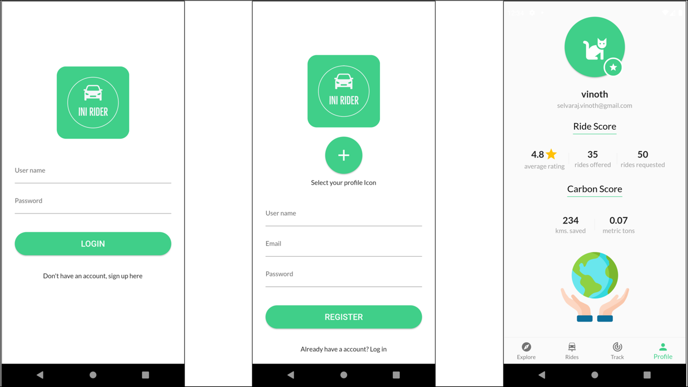
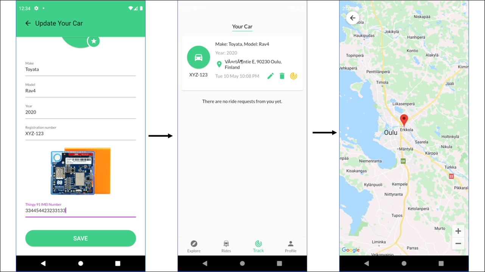
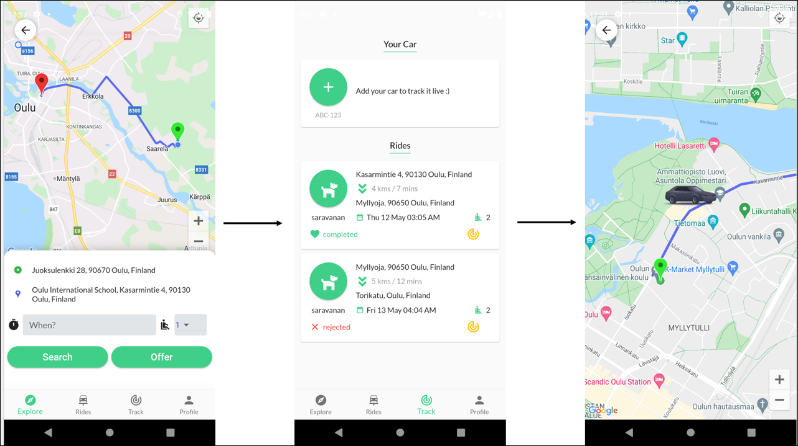

# iNi Rider Mobile application

iNi Rider is a car ride sharing / pooling application built using flutter utilising the GPS capabilities of the Nordic Thingy 91 to collect the location coordinates of the cars. 

## Getting Started

**Prerequisites**  

Please follow installation instructions for Flutter for your operating system to get started.
- [flutter](https://docs.flutter.dev/get-started/install) 

**Configuration**
1. The mobile application uses the AWS IoT device certificated to connec to the MQTT topics in AWS IoT. Create a folder certs under assets as shown below and copy the ceritifcates generated as explained in the [iNi Rider API service](https://github.com/vinoselv/ini-rider-api/blob/main/doc/AWSIoTCore.md#create-thing--device-certificate) repository.
   - assets 
      - certs
        - *thing-name*.cert.pem
        - *thing-name*.private.key
        - root-CA.crt
      - fonts
      - images  
2. Create a file *secrets.json* in the root folder with 
    ```
    {
        "map_api_key": "<google maps api key>",
        "aws_base_url": "<iNi Rider API service URL>",
        "aws_cognito_post_url": "<AWS cognito endpoint URL>",
        "aws_cognito_app_user_name": "<USER_POOL_CLIENT_ID>",
        "aws_cognito_app_secret": "<USER_POOL_APPLICATION_CLIENT_SECRET>"
    }
    ```
The valus for the environment variables can be extracted from the .env.{stage}file generated during the iNi Rider service API [deployoment](https://github.com/vinoselv/ini-rider-api/blob/main/doc/GettingStarted.md#deployment).


Also replace the Google Maps api key placeholderin the *android\app\src\main\AndroidManifest.xml*

**Run**  
The application can be run against the local serverless-offline deployment or the AWS cloud deployment depending on the *aws_base_url*.

You can use terminal or any IDE of your choice to run the Flutter applications

```
flutter run
```

**Limitations**
- The application is not run / tested for iOS.
- The application test coverage is very limited due to the time limitations.
- The code can be still optimised / improved to fix the performance and reliablity issues.

**documentation**

The iNi Rider API is a backend service that collects and manages the data required for the iNi Rider application. Please check the 
[iNi Rider API service](https://github.com/vinoselv/ini-rider-api) documentation for more details.

## Screenshots
**Registration**

 

**Car live tracking**

 

**Ride live tracking**

 